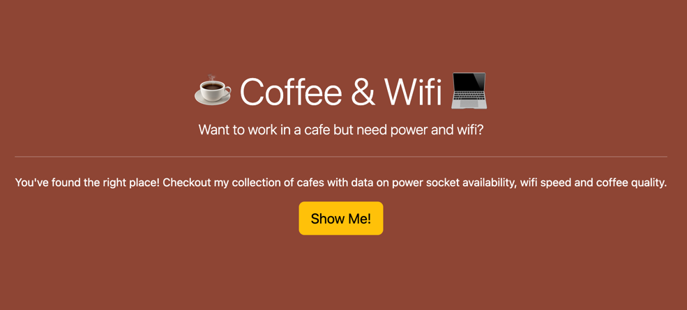
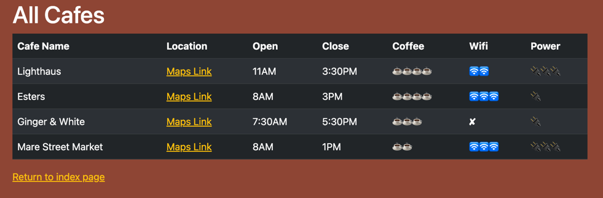
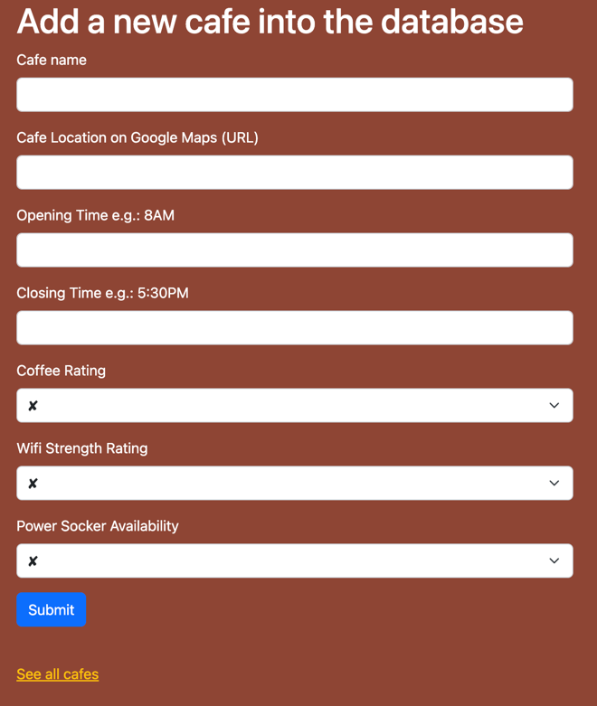

# LinkedIn Automation
- This project served as an exercise in creating a web page using Python, Flask, WTForms, and Bootstrap!
- It even updates a csv file upon form submission!


## Installation
1. Create a directory on your machine to house it. Something such as "PythonWebpage" should work
```commandline
mkdir PythonWebpage 
```
2. Look above and select "Code"
3. From here, copy HTTPS web URL
4. Return to your terminal and clone the repo.
```commandline
git clone https://github.com/LanoCodes/Coffee-and-Wifi.git
```
5. Using your favorite IDE, open the PythonWebpage folder.
6. Navigate to main and run the program from there. You will need to make sure to have the all the necessary packages installed.

## Usage & Thoughts
- Below are some snaphshots of what this should look like when you spin it up.
- Check out it out and experience the functionality for yourself!
- Also, be sure to check out the add cafe funcitonality after running main to be able to see it all come together
- This project pieces together Python, Flask, WTForms, and Bootstrap.
- Feel free to make changes!
- 
- 
- 